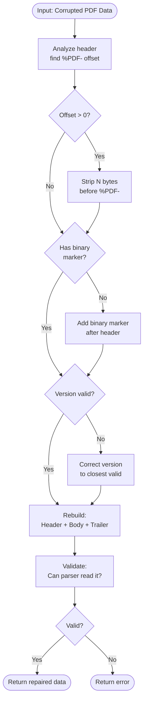

# PDF Repair Operations Flow

```mermaid
flowchart TD
    Start([Input: Corrupted PDF Data])
    
    Analyze[Analyze header<br/>find %PDF- offset]
    
    Decision1{Offset > 0?}
    Strip[Strip N bytes<br/>before %PDF-]
    
    Decision2{Has binary<br/>marker?}
    AddMarker[Add binary marker<br/>after header]
    
    Decision3{Version valid?}
    FixVersion[Correct version<br/>to closest valid]
    
    Rebuild[Rebuild:<br/>Header + Body + Trailer]
    
    Validate[Validate:<br/>Can parser read it?]
    
    Decision4{Valid?}
    Success([Return repaired data])
    Fail([Return error])
    
    Start --> Analyze
    Analyze --> Decision1
    Decision1 -->|Yes| Strip
    Decision1 -->|No| Decision2
    Strip --> Decision2
    Decision2 -->|No| AddMarker
    Decision2 -->|Yes| Decision3
    AddMarker --> Decision3
    Decision3 -->|No| FixVersion
    Decision3 -->|Yes| Rebuild
    FixVersion --> Rebuild
    Rebuild --> Validate
    Validate --> Decision4
    Decision4 -->|Yes| Success
    Decision4 -->|No| Fail
```