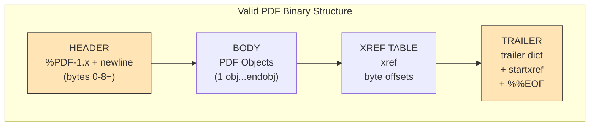

## PDF Structure Specification




## Header Specification (PDF Reference 1.7)

```text
Byte Structure:
[0-4]:   %PDF-        (literal string, 5 bytes)
[5]:     Major version (ASCII digit, 1 byte)
[6]:     .            (period, 1 byte)  
[7]:     Minor version (ASCII digit, 1 byte)
[8+]:    \n or \r\n   (newline, 1-2 bytes)
[9+]:    Optional binary marker (%âãÏÓ or similar 4+ bytes with high bits)

```

