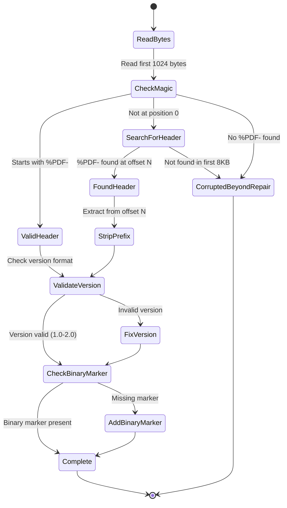

# Detection Algorithm

```mermaid
stateDiagram-v2
    [*] --> ReadBytes
    ReadBytes --> CheckMagic: Read first 1024 bytes
    
    CheckMagic --> ValidHeader: Starts with %PDF-
    CheckMagic --> SearchForHeader: Not at position 0
    CheckMagic --> CorruptedBeyondRepair: No %PDF- found
    
    SearchForHeader --> FoundHeader: %PDF- found at offset N
    SearchForHeader --> CorruptedBeyondRepair: Not found in first 8KB
    
    FoundHeader --> StripPrefix: Extract from offset N
    ValidHeader --> ValidateVersion: Check version format
    
    ValidateVersion --> CheckBinaryMarker: Version valid (1.0-2.0)
    ValidateVersion --> FixVersion: Invalid version
    
    CheckBinaryMarker --> Complete: Binary marker present
    CheckBinaryMarker --> AddBinaryMarker: Missing marker
    
    StripPrefix --> ValidateVersion
    FixVersion --> CheckBinaryMarker
    AddBinaryMarker --> Complete
    
    Complete --> [*]
    CorruptedBeyondRepair --> [*]
```