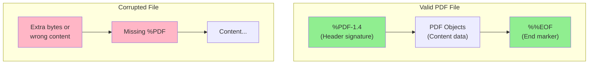
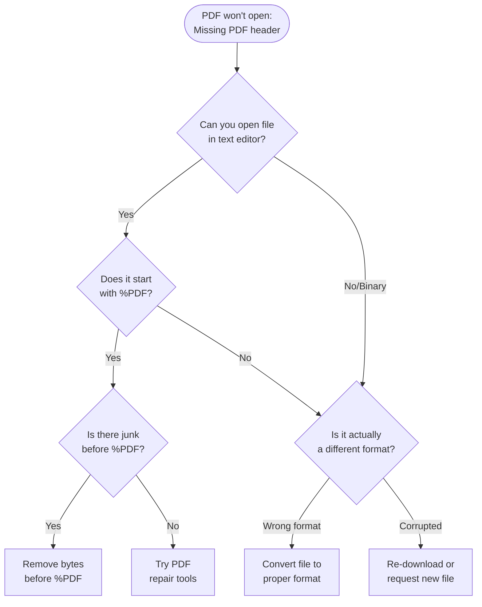

## What's a PDF Header?

Every valid PDF file must start with a specific signature that looks like `%PDF-1.4` (or similar version number). This tells software "I'm a PDF file!"

Here's the structure:

mermaid



## Diagnostic Flow

mermaid



## Practical Fixes

**Method 1: Check and Clean the Header**

bash

```bash
# View first 20 bytes of file (Mac/Linux)
head -c 20 yourfile.pdf | od -c

# Should see: %PDF-1.x
```

If you see extra bytes before `%PDF`, you can remove them:

bash

```bash
# Find where %PDF starts, then extract from there
grep -abo "%PDF" yourfile.pdf  # Shows byte offset
dd if=yourfile.pdf of=fixed.pdf bs=1 skip=N  # N = offset number
```